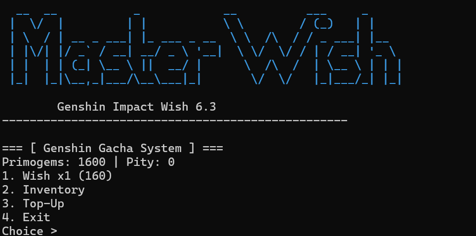
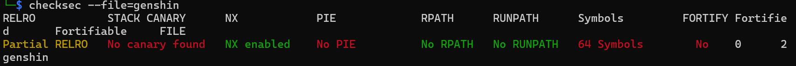
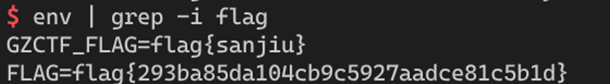

# Genshin Wish 6.3 Writeup
Link to the question: https://ctf.bugku.com/challenges/detail/id/3030.html

## Overview


Key points to examine
- Pseudo-random number prediction (srand(time(0)))
- Stack Overflow
- ROP

Attachment
- genshin (ELF 64-bit)
## Protection Mechanism

```bash

checksec genshin
```


## Static Analysis

Decompiling the main function and related logic using Ghidra:

- Random number initialization: The program calls `srand(time(0))` at startup. This means that if an attacker can synchronize the server's timestamps, they can predict all the card draw results.

- Hidden logic: Code analysis revealed that when a specific character is drawn (e.g., Columbina, index 7), the program enters a hidden function that prints "You seek to change your fate? Sign here...".

- Vulnerability: In the hidden logic, the program uses `read()` to read user input into a 64-byte buffer, indicating a clear stack overflow vulnerability.

## Vulnerability Analysis

### Random Number Prediction
The card-drawing logic relies on `libc.rand()`. Since the seed is `time(0)` (second-level precision), we can simulate the card-drawing process locally.

Objective: Find a future timestamp such that within a limited number of draws (e.g., 20 draws), the generated random number sequence will hit the character Columbina.

### Offset Calculation
Calculate the distance from `buf` to the return address using GDB debugging

The buffer size is 64 bytes (0x40).

Add the 64-bit `rbp` register (8 bytes).

Total Offset = 72 bytes.

### Target Jump
Since there is no PIE, we directly search the symbol table for the target function `abiess_gateway` (usually the backdoor function that executes `system("/bin/sh")`).

Use ROPgadget to find the ret instruction for stack alignment.

## Exploit Idea
The exploit strategy for this problem involves two steps

- Synchronize the seed: Simulate `rand()` locally and wait for the optimal moment to connect to the server.

- Trigger the overflow: After hitting the hidden plot, send a payload to overwrite the return address to `abyss_gateway`.

