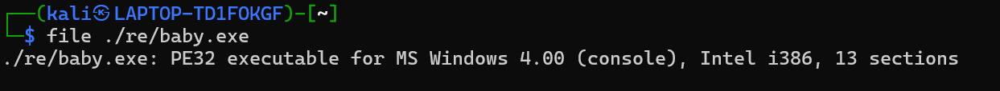
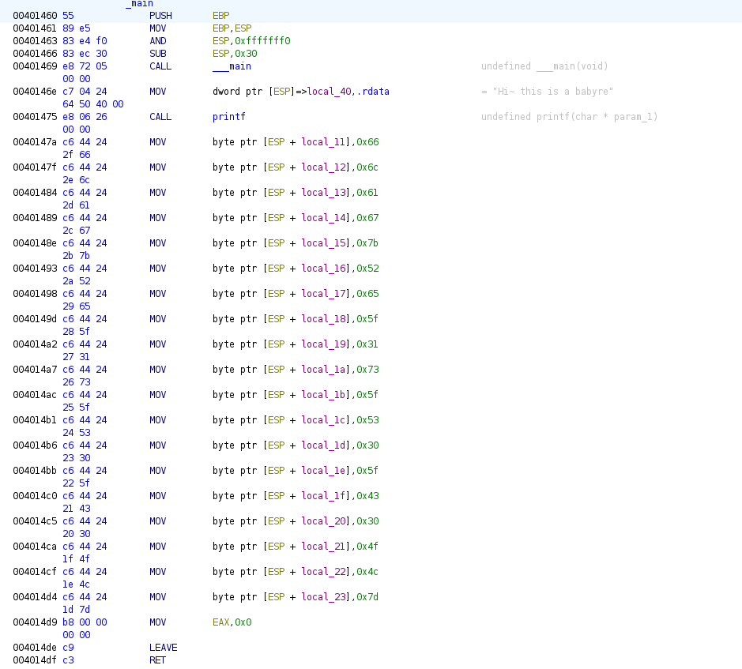

# Easy_re Writeup
Link to the question: https://ctf.bugku.com/challenges/detail/id/99.html

## Overview
Unzip the download zip. Then check the file feature

Use Ghidra to open this file, then search ``main`` function. 
You will see the "odd" code segment, transfer it you can get flag.

